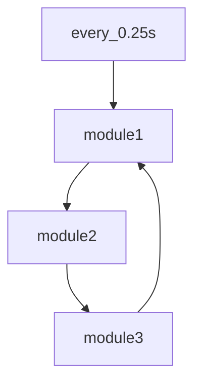

NEW DOCS in progress
use old docs in the meantime: [old docs](./readme_old.md)

# Lume-Deployment 

Lume-Deployment - soon to be renamed, is a package that allows you do deploy any model with an arbitrary number of inputs and outputs, related data transformations and system interfaces. 

Each deployment is defined by a model, typically hosted and retrieved from [MLFlow](https://mlflow.org/) and YAML file that describes the DG (Directed Graph) of model, transformations and interfaces. There are no restrictions on the numbers and types of nodes in the graph, so it may be used for things other than ML models.

## Installation

Python `3.11.x` recommended.

```bash
pip install -r reqirements.txt
pip install .
```
for development:

```bash
pip install -r reqirements.txt
pip install -e .
```

## Usage

```python
model_manager --publish -c ./tests/pv_mapping_mlflow.yaml -e ./tests/env.json
```
The env file is a json file that contains the environment variables that are used in the deployment. In this example we are pulling the [torch](./examples/torch_and_generic.ipynb) model and wrapping it with simple transformers and a simple p4p server.  

Reqired variables are:
- `AWS_ACCESS_KEY_ID`
- `AWS_SECRET`
- `AWS_DEFAULT_REGION`
- `AWS_REGION`
- `MLFLOW_S3_ENDPOINT_URL`
- `MINIO_ROOT_PASSWORD`
- `MINIO_ROOT_USER`
- `MINIO_SITE_REGION`
- `MLFLOW_TRACKING_URI` 
- `PUBLISH` - set to `true` for the deployment to publish data to the interface. This flag serves as a safety measure to prevent accidental publishing of data to live system. 

See [this](https://mlflow.org/docs/latest/api_reference/python_api/mlflow.environment_variables.html) for explantions of the MLFlow environment variables.

## Configuration file (formerly pv_mappings files)

The configuration file consists of 2 sections `deployment` and `modules`. Former describes deployment type and other setings such as refresh rate. The latter describes the nodes the modules and their connections to each other. 


#### Example configuration file
```yaml
deployment:
  type: "continuous" #type of deployment, continuous is the only one supported at the moment but more will be added
  rate: 0.25 #refresh rate in seconds

modules:
    module1:
        name: "module1"         # name of the module used to identify it in the graph
        type: "type.subtype"    # type of the module, used to identify the module class and subclass 
        pub: "topic1"           # topic the outputs will be published to, similar to MQTT, Kafka, ROS etc 
        sub:                    # topics the module will subscribe to, we listen for and transform data from these topics
        - "get_all"             # get_all is a special topic that will trigger an interface module to run get_all method (get_many for all keys)
        - "topic3"              
        module_args: None       # defines what arguments to pass to the module observer, if any this can inform unpacking etc
        config:                 # configuration specific to the module type
            key1: "value1"
            keyn: "valuen"

    module2:
        ...
        pub: "topic2"
        sub:
        - "topic1"
    module3:
        ...
        pub: "topic3"
        sub:
        - "topic2"
```
The graph for the above configuration would look like this:



Under the hood we are passing messages in the format:

```json
{
    "topic": "topic1",
    "data": {
        "key1": {"value" : 1},
        "key2": {"value" : [1,2,3]},
        "key3": {"value" : {...}}
    }
}
```
Note that the data is a dictionary of dictionaries.

## Modules

### Interface
Interface modules are used to interact with external data, usually an accelerators control systems but can be anything. They follow the following structure (see [base interface class](./model_manager/src/interfaces/BaseInterface.py)):

```python
class BaseInterface(ABC):
    @abstractmethod
    def __init__(self, config):
        pass

    @abstractmethod
    def monitor(self, name, handler, **kwargs): # not used at the moment but will be used to monitor the interface for changes, rather than polling when p4p can monitor more than 4 pv's
        pass

    @abstractmethod
    def get(self, name, **kwargs):              # get a value from the interface
        pass

    @abstractmethod
    def put(self, name, value, **kwargs):       # put a value to the interface
        pass

    @abstractmethod
    def put_many(self, data, **kwargs):         # put many values to the interface
        pass

    @abstractmethod
    def get_many(self, data, **kwargs):         # get many values from the interface
        pass
```
All values are expected to come in as dictionaries of dictionaries with the following format:

```python
# for sigular puts and gets
name = "key1"
value = {"value" : 1, "timestamp": 1234567890, "metadata": "some meta data"}        # note tha the timestamp and metadata are optional and unusued at the moment

# for _many 
data = {
    "key1": {"value" : 1, "timestamp": 1234567890, "metadata": "some meta data"},
    "key2": {"value" : [1,2,3]},
    "key3": {"value" : {...}}
}
```
#### Interface Configs
| Module | Description | YAML configuration | Compatible with: |
| ------ | ----------- | ------------------ | --------------- |
| `p4p` | EPICS data source, must have an external EPICS server running. Note that SoftIOCPVA will not work with this module. | [config](#p4p-sample-configuration) | `SimpleTransformer`, `CompoundTransformer` |
| `p4p_server` | EPICS data source, host EPICS p4p server for specifed PVs | same [config](#p4p-sample-configuration) as `p4p`| `SimpleTransformer`, `CompoundTransformer` |
| `k2eg` | Kafka to EPICS gateway, get data from Kafka and write it to EPICS | [config](#k2eg-sample-configuration) | `SimpleTransformer`, `CompoundTransformer` , `CAImageTransformer`* |

##### `p4p` sample configuration
```yaml
deployment:
    ...
modules:
    mymodule:
    ...
    config: 
      EPICS_PVA_NAME_SERVERS: "epics.server.co.uk:5075"
      # other EPICS_CONFIGS can go here
      variables:
        MY_VAR:TEST_A:
          proto: pva
          name: MY_VAR:TEST_A # name here is redundant as the name is the key in the variables dictionary, it will be removed in future versions
        MY_VAR:TEST_B:
          proto: pva
          name: MY_VAR:TEST_B
        MY_VAR:TEST_S:
          proto: pva
          name: MY_VAR:TEST_S
          # default: 0 | [0.0, ... ,0.0] | no defaults for images   optional
          # type: scalar | waverform | image (default scalar)       optional
```

##### `p4p_server` sample configuration
```yaml
    config: 
      EPICS_PVA_NAME_SERVERS: "epics.server.co.uk:5075"
      # other EPICS_CONFIGS can go here
      variables:
        MY_VAR:TEST_A:
          proto: pva
          name: MY_VAR:TEST_A
        MY_VAR:TEST_B:
          proto: pva
          name: MY_VAR:TEST_B
        MY_VAR:TEST_S:
          proto: pva
          name: MY_VAR:TEST_S
          # default: 0 | [0.0, ... ,0.0] | no defaults for images   optional
          # type: scalar | waverform | image (default scalar)       optional
```
Yes, it is identical to p4p, the only difference is that the p4p server will host the PVs for the specified variables.

##### `k2eg` sample configuration
 
TODO - See old [docs](./readme_old.md) for now.

### Transformer

### Model 


